# Teaching and Professional Role

## TRU Library Makerspace Librarian

My primary role is overseeing the TRU Library Makerspace, which I proposed in 2019 and launched in spring 2022. Over the past two years, the Makerspace has grown from an experimental space into a vibrant community hub where students, staff, and faculty come together to learn, create, and support each other. I am ridiculously proud of the positive little space and so I hope dear reader you will forgive the length of the following sections. 

Throughout this APAR, I often use "we/us" instead of "I/me" because the Makerspace has always been an intentionally collaborative project. From the beginning, I knew this space would only work if everyone - our amazing Library Technicians, student workers, Library Administration, and faculty collaborators - had meaningful opportunities to contribute. While I set the vision and values that guide our work, many of the accomplishments described here reflect our collective efforts. I use "we" when projects truly were collaborative, but I'm careful to use "I" when describing my specific contributions and leadership. When some else wrote something under my direction I name them. 

Rather than organize this chronologically, I've grouped activities thematically to better show how different initiatives connect to support our core mission of creating an inclusive, experimental learning space. Specific dates are noted in parentheses or in the text.

### Development of the Makerspace as an Academic Program: Aligning Vision with Practice and Placemaking

In our first months after opening, I quickly learned that maintaining our vision meant being thoughtful about both practice and placemaking. I saw how easy it would be to drift from our core pedagogies - for example, by over-helping users in the name of good service, or by letting the space become just another computer lab or print shop. 

As we got busier, we faced key moments that required balancing practical needs with our values. One came early, before we had established processes for 3D printing. Another emerged in fall 2023, when staff and I noticed concerning shifts in how some users approached the space - less respect for materials, more frustration with equipment, and a tendency to discard the direction of staff. Each time, I worked with our team to find solutions that addressed immediate needs while staying true to our vision.

The projects below show how I've worked to develop the Makerspace as an academic program with clear pedagogies and values. Increasingly, I find belonging woven into every aspect of my teaching practice and philosophy. Belonging provides the safety learners need to try new things, work on personally meaningful projects, and learn from mistakes. This section also includes projects related to placemaking. 

Signage created by Makerspace staff encouraging users to explore and use equipment and supplies

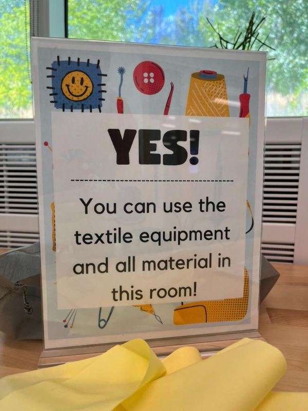

#### Defining Our Values and Pedagogies: Program Description and Code of Conduct

In April 2024, after extensive consultation and revision, I successfully led the approval of our Code of Conduct and Program Description through the University Libraries Divisional Council (ULDC). I'm genuinely proud of these governance documents, which reflect over two years of learning what works and what doesn't, and over a year of consultation and revision with Makerspace staff, students, Indigenous faculty, and colleagues in the Department and on ULDC.

The Program Description defines our core values (equitable access, belonging, community, Indigenization, sustainability, and critical making) and provides specific language about how these values guide our work. For example, our Indigenization statement, shaped by feedback from Indigenous faculty, states:

> "Makerspace supports Indigenization by facilitating and, where possible, resourcing Indigenous-led workshops and activities. Indigenous instructors maintain control over their knowledge, practices, and tools and determine the participants of their workshops and events."

Our pedagogical approaches - Active Learning, Self-Directed Learning, Interest-Based Learning and Autonomy, and Experimentation and Play - emerged from two years of watching what works (and what doesn't) in the space. These approaches define our unique position on campus and guide our programming, workshops, community building, and partnerships.

The Code of Conduct, initially developed by my colleague Erin May for our 2020 Pilot Makerspace, sets behavior expectations to create a safe learning environment that supports our pedagogies and values. This document has been revised based on experience and feedback to ensure it protects everyone from discrimination and clarifies roles for staff and users.

Attachments: 

- [[TRU Library Makerspace Program Description FINAL FOR ULDC.pdf]]
- [[TRU Library Makerspace Code of Conduct FINAL FOR ULDC.pdf]]

#### Developing a Student Ambassador Program

During this APAR period, I've hired and mentored 12 Student Ambassadors, maintaining a team of five each term. 

The Makerspace Student Ambassador program was launched in fall 2022. While the immediate need was about expanding our support of users, my real goal was fostering student belonging. I wanted our Ambassadors to reflect the diversity of our student community so that users would see themselves reflected in the space. I also wanted them to bring their own experiences and perspectives to the space and help make us better. 

Makerspace Ambassadors:

- Give tours of the Makerspace to new users and small groups.
- Help users get started with technologies, such as:
	- Assigning 3D printers and approving prints based on rules and guidelines.
	- Setting new users up with the 3D token tutorial.
	- Assisting users with VR setup and tutorials.
	- Helping users find information, tutorials, and guides on the website.
- Keep statistics using the stats sheet.
- Assist Makerspace staff as requested.
- Maintain awareness of people entering the space and greet them promptly.
- Represent TRU, the Library, and the Makerspace professionally, following the Code of Conduct.
- Avoid working on personal projects, homework, or taking phone calls during shifts.
- Ensure equal treatment for all users, without preferential treatment for friends.
- Follow all Makerspace rules during personal time in the space. 

As of June 2024, the program has become integral to how we operate and I honestly can't picture the Makerspace without our Student Ambassadors. They bring fresh energy, challenge my assumptions, connect us with new students, and make our space more welcoming and inclusive. I regularly see how some students gravitate towards an Ambassador and find support their they wouldn't have found elsewhere because they feel safer with that person.  

Most Ambassadors return each semester until they graduate, which has created natural mentorship opportunities and deepened our impact and relationships with them. Several have gone on to become research assistants for faculty working on active learning or technology projects. Even after graduating, former Ambassadors often drop by to share their successes or work on new projects.

My responsibilities include:

- Recruiting, interviewing, and selecting candidates
- Creating schedules that balance their academic commitments with our needs
- Providing ongoing mentorship
- Assigning special projects based on their experience and interests, for example, I have assigned projects related to outreach, social media, 3D design, textiles, Indigenization, etc. 
- Working with Makerspace staff to resolve any issues that arise with Ambassadors
- Supporting their professional development

Key developments during this APAR:

- Started with establishing basic program structure and learning how Ambassadors could effectively engage with users. This first year revealed issues with Ambassadors needing more work experience and clearer guidance about their responsibilities (2022)
- Created formal Ambassador charter and FAQ to clarify roles and emphasize creating a welcoming atmosphere and supporting our pedagogies. (2023)
- Refined recruitment to focus on finding students passionate about supporting hands-on learning (through communications and blog posts), to make the process more accessible (by providing questions ahead of time), and adjust for an increased use in AI by students (through communications and adjustments to interview questions). 

I continue to refine the program by focusing on helping Ambassadors understand their role in relation to our pedagogies and values, encouraging peer mentorship, and supporting their growth as independent learners. These improvements are included in my goals for next year.

Attachments:

- Student Makerspace Ambassador Charter 2024.pdf
- Makerspace Ambassador FAQ 2024.pdf

Links:

- [Our Team – TRU Library Makerspace (C7elelkstén’)](https://makerspace.trubox.ca/about/our-team/) We keep the bios of old team members, including Ambassadors, on our website Team page, to continue to recognize their contributions to the Makerspace and help them have professional materials that can be found on the Internet. 
- Article by my Research Assistant Kirsten Glass introducing the new program in November, 2022: [[New School Year, New Ambassador Program! – TRU Library Makerspace (C7elelkstén’)]]
- Blog posts announcing new positions
	- [[Become a Makerspace Student Ambassador! (CLOSED) – TRU Library Makerspace (C7elelkstén’)]] January, 2024
	- [[We’re Hiring Makerspace Student Ambassadors for September, 2024! (CLOSED) – TRU Library Makerspace (C7elelkstén’)]] April, 2024
	- [[Become a Makerspace Student Ambassador! (Now Closed) – TRU Library Makerspace (C7elelkstén’)]] July, 2022

Makerspace Ambassador Adrian Romeo

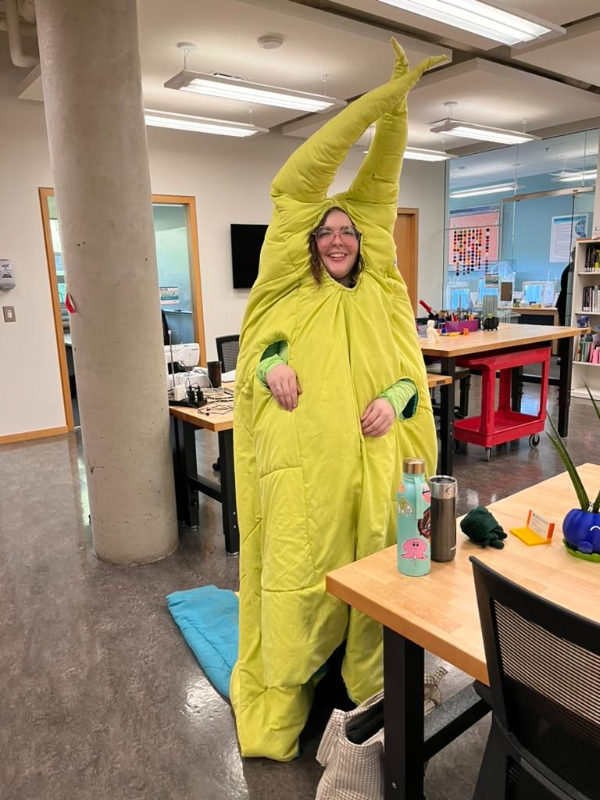

#### CELT Faculty Makerspace Grants 2022-2024

In fall 2022, I partnered with Diane Janes from CELT to create grants of up to $2000 to help faculty integrate making and hands-on learning into their curriculum. This wasn't just about getting more classes into the Makerspace. I wanted to support faculty in reimagining their teaching through active learning and experimentation.

The resulting five awards to faculty from Social Work, Fine Arts, and the Faculty of Student Development have been fascinating. Visual Arts faculty member Twyla Exner had her students use our 3D scanners to explore questions about public art and monuments. They scanned their sculptures, experimented with placing them in virtual reality, and thought deeply about how technology changes our relationship with art. Career and Experiential Learning faculty Harshita Dhiman and Katelin Pietrusinski brought together students from different disciplines to prototype networking tools, turning what could have been a theoretical discussion into hands-on learning about teamwork and professional communication.

My role:

- Worked with Dr. Janes to develop grant criteria that encouraged innovation while staying true to our unique pedagogical model and values
- Consulted with interested faculty
- Participated in selecting grant recipients
- Provided ongoing support and mentorship to faculty as they developed their projects
- Collaborated closely with grant recipients:
	- Helped Harshita and Katelin think through how makerspace pedagogies could enhance their project goals and supported them in hiring and mentoring a research assistant. Then attended student presentations to provide feedback.
	- Helped Twyla find a research assistant, provided her class with tutorials on 3D scanning, and helped with VR implementation. 

Links:

- [The Makerspace Grant: Adding Innovation into the Classroom by Harshita Dhiman and Katelin Pietrusinsk, Department of Career and Experiential Learning – TRU Library Makerspace (C7elelkstén’)](https://makerspace.trubox.ca/2023/12/11/the-makerspace-grant-adding-innovation-into-the-classroom-by-harshita-dhiman-and-katelin-pietrusinsk-department-of-career-and-experiential-learning/) by Harshita Dhiman and Katelin Pietrusinsk, faculty members in the Department of Career and Experiential Learning as part of their Makerspace CELT Grant (December 2023) 
- [Unmade Monuments: Exploring Public Space Through Prototyping Monuments and Public Sculptures by Twyla Exner, Assistant Teaching Professor, Department of Communication & Visual Arts – TRU Library Makerspace (C7elelkstén’)](https://makerspace.trubox.ca/2023/08/08/unmade-monuments-exploring-public-space-through-prototyping-monuments-and-public-sculptures-by-twyla-exner-assistant-teaching-professor-department-of-communication-visual-arts/) (August 2023) by Visual Arts faculty member Twyla Exner as part of their CELT Faculty Grant 
- [2023 CELT Faculty Makerspace Grant Awardees – TRU Library Makerspace (C7elelkstén’)](https://makerspace.trubox.ca/2023/04/28/2023-celt-faculty-makerspace-grant-awardees/) By Franklin Sayre, April 28, 2023
- [The Makerspace Faculty Grant – Supporting learning through making – TRU Library Makerspace (C7elelkstén’)](https://makerspace.trubox.ca/2023/02/08/the-makerspace-faculty-grant-supporting-learning-through-making/) by Kirsten Glass , February 2023

A 3D print of campus made with a drone and photogammetry that was part of faculty member Twyla Exner's Makerspace Grant

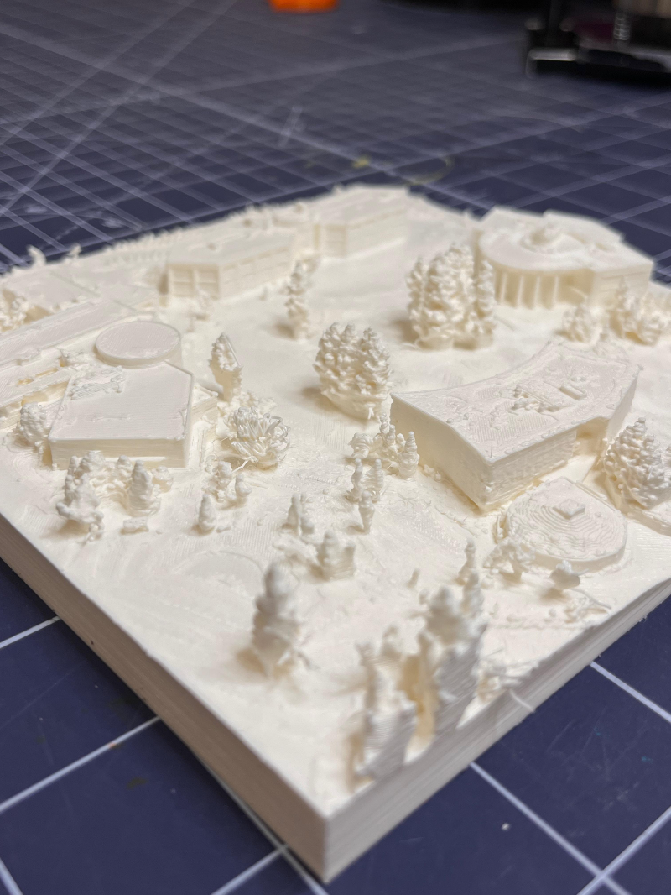

#### Encouraging Learning and Meaningful Projects: 3D Printing Guidelines

I oversee the creation of all the instructional material that we have in the Makerspace, though we try not to create too many new things and instead find existing material to point to online. Here I want to focus on a specific project. 

In October 2023, I revised our 3D printing guidelines to better align with our pedagogies and to encourage sustainability while still maintaining equitable access. I had noticed that while many users transitioned from printing online designs to creating their own objects, a few were repeatedly printing low-value items, which not only created waste but meant fewer opportunities for others to use the printers. 

To address these issues, I developed new guidelines with input from staff and students, focusing on maintaining access while encouraging learning and experimentation. The updated rules reduced the maximum print time for ready-made designs, while increasing the print time for objects people designed or modified. This encouraged experimentation with design and settings while still allowing ready-made objects to be printed, since they are a gateway to 3D printing for most new users and increase the diversity and equity of our space. 

I also established a print failure reporting process to facilitate learning through trial and error and to encourage users to see the entire printing process as part of their learning. 

I also changed how we track prints on our whiteboards after watching Valentine, one of our technicians, include details like print time and support material when troubleshooting failed prints. Now everyone records these details, which helps users to engage with printing details and reinforces their learning. 

Attachments:

- 3d printing rules.pdf
- 3d printing guidelines.pdf
- New 3D Printing Rules and Guidelines – TRU Library Makerspace (C7elelkstén’).pdf

Whiteboard used to assign printers and share details about the current 3D print

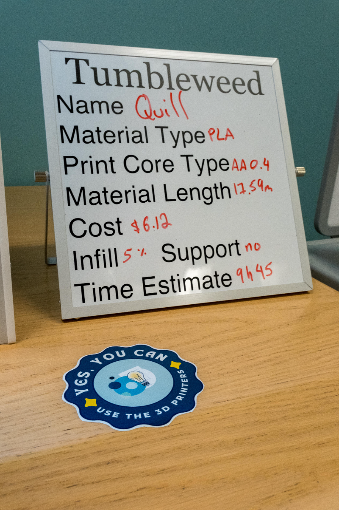

#### Identity Token Wall (2023)

Sometimes the most meaningful changes happen by accident. We've always used a simple 3D printed "identity token" as a tutorial for new users - it's adapted from local elementary curriculum and provides a friendly entry point to 3D printing. Initially, users would take their tokens home or, more often, leave them behind to be recycled. 

As part of the project outlined above, I had an idea: what if their first print could be a gift to our community instead? Now, users' first tokens go up on our wall, with the option to print a second one to keep. This small change is one of the many we made to encourage belonging and community. It also connects with the third challenge I give during my "Welcome to the Makerspace" talk - that the first thing you make should be a gift for someone else. 

Photo of the Identity Token wall when it first went up

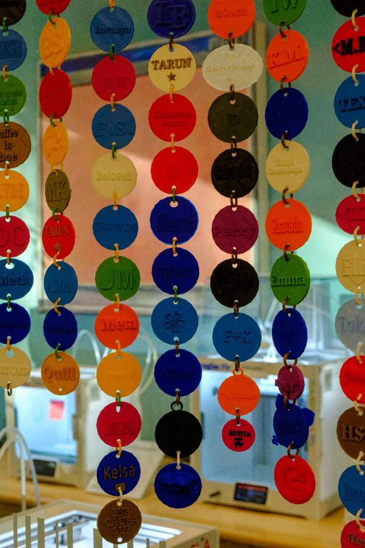

#### Artwork Installation (2024)

In spring 2024, working with faculty member Terryl Atkins from the Faculty of Arts as well as CUPE staff, I arranged for student artwork from TRU's permanent collection to be installed in the Makerspace. We chose pieces that capture the playful, experimental spirit of our space - work that shows what's possible when students feel free to take creative risks.

Links:

- [Artwork added to Makerspace! – TRU Library Makerspace (C7elelkstén’)](https://makerspace.trubox.ca/2024/03/08/artwork-added-to-makerspace/) by Sarah Porter (March, 2024)

Paintings in the TRU Library Makerspace

#### White Board Questions (2022 - Ongoing)

Shortly after we opened, I started writing weekly questions on our whiteboard for users to answer. Staff quickly took over choosing questions, and their creativity has far surpassed mine. The questions are silly ("Draw your favorite dinosaur!"), thoughtful ("What are you proud of making?"), or somewhere in between. 

I include this in my APAR because it exemplifies my leadership approach: set up simple structures that support our values, then get out of the way and let others make them better. The whiteboard has become a constantly changing record of our community - full of inside jokes, mutual encouragement, and shared creativity. It shows how small, consistent practices can help create the kind of welcoming, playful space we want to be.

Links:

- [2022-2023 White Board Questions of the Week – TRU Library Makerspace (C7elelkstén’)](https://makerspace.trubox.ca/2023/11/14/2022-2023-white-board-questions-of-the-week/) Blog post by Makerspace Staff Olivia Strodl featuring a year of pictures of our whiteboard questions. 

#### Created a "take a Button, Leave a Button Board" (2023)

I worked with staff to create a simple "Take a Button! Leave a Button!" board to encourage belonging and community engagement after the idea was suggested by a faculty collaborator. Simple, even silly, projects like this are central to our space and their impact feels disproportionately positive to the effort they require.

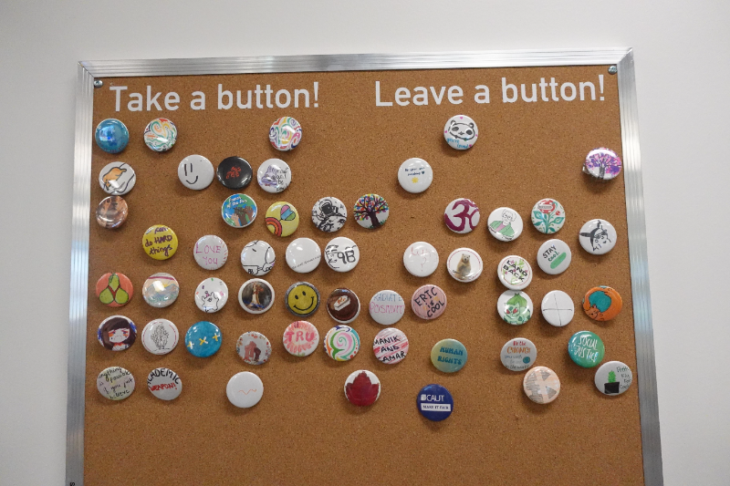

#### Community Bulletin Board (2023)

Our bulletin board provides a place for students and other members of the TRU Library Community to share upcoming events, collaborations, ideas, etc. it is regularly used and changes frequently. 

#### EDI Literature Review (2023)

In 2023, I worked with Syreena Bhattacharya, a Makerspace Student Ambassador, to conduct a literature review on the retention of Women, LGBTQ+, Gender Non-Conforming, and BIPOC individuals in STEM fields. From this research, we learned the importance of fostering a sense of belonging and creating a welcoming environment. It also reinforced my efforts to remove barriers as one way of limiting opportunities for microaggressions, as well as my belief in ensuring our student ambassadors represented the diversity of our campus. 

#### Makerspace Bingo

In fall 2022, I worked with staff to create a "Makerspace Bingo" game to encourage students and faculty to explore our technology and tools. We designed a bingo card featuring activities like button-making, vinyl cutting, 3D printing, and virtual reality. I established the bingo framework, and together we developed the categories, with a staff member finalizing the design. Now, new users and CUPE staff, along with Student Ambassadors, use this game for training. 

Attachments:

- [[Print this one! MS bingo.png]]

### Welcoming Users to the Makerspace: Classes, Tours, Events, Outreach

Total teaching I've led during this APAR period: 

- 2022 (after July 1): 8 events with 208 attendees.
- 2023: 26 events, 485 participants.
- 2024 (to June 30) 8 events with 156 attendees

Since opening, I've been developing a "Welcome to the Makerspace" talk to communicate our core values and pedagogical approach to everyone, from first-year students to the most tenured of faculty. 

I start with a land acknowledgement that connects to the legacy of making and stewardship in this place and prompts people to think about how their own making will become part of that story. Then I ask people to reflect on technologies they already use confidently - cooking, art, fixing bikes. This helps communicate that everyone brings valuable prior-learning to the Makerspace. The rest of the talk emphasizes that the space is for everyone, and invites them to follow their interests and passions, another way of connecting learning with their lived experiences. 

I conclude the talk with three challenges: 

1. Make something personally meaningful.
2. Create an object that tells a story rather than just making a thing.
3. Make your first project a gift for someone else, connects to Indigenous ways of learning, bringing us full circle to the land acknowledgement. 

I've given versions of this welcome to over 800 students through more than 40 instructional sessions, adapting it for groups from Engineering to Business to Arts. What excites me is seeing how different disciplines connect with our core ideas - like the biology student who combined their GIS knowledge with our 3D printers to model watersheds, or the Education students exploring how active learning could transform their future classrooms.

#### List of Class Orientations and Instruction

- 2022-09-23: ENGR 1100 class tours (70 attendees)
- 2022-09-28: VISA 3D Foundation (18 attendees)
- 2022-09-29: VISA 2D Foundation (15 attendees)
- 2022-10-03: VISA Sculpture 1 (13 attendees)
- 2022-10-05: Education Class (30 attendees)
- 2022-10-07: MNGT1710 Introduction to Business (25 attendees)
- 2022-10-27: Engineering class tour (20 attendees)
- 2022-11-04: ORGB 3750 Creativity and Innovation(17 attendees)
- 2023-01-16: Engineering design class tour - group 1 
- 2023-01-16: Engineering design class tour - group 2 (8 attendees)
- 2023-01-18: Visual arts class tour (14 attendees)
- 2023-01-20: Visual arts class tour (14 attendees)
- 2023-01-23: Visual arts class tour (12 attendees)
- 2023-01-31: Adventure Studies class tour (22 attendees)
- 2023-02-14: Creativity and Innovation class tour (31 attendees)
- 2023-02-15: Education Class Tour (25 attendees)
- 2023-02-16: Tour for empowering geographies (15 attendees)
- 2023-05-02: Co-op tour (Harshita's class) (33 attendees)
- 2023-05-03: Co-op tour 1 (Katelin's class) (17 attendees)
- 2023-05-03: Co-op tour 2 (Katelin's class) (16 attendees)
- 2023-05-09: EDUC 5030 class tour (18 attendees)
- 2023-05-09: EDUC 5030 tour (21 attendees)
- 2023-07-25: EDUC 5030 tour (19 attendees)
- 2023-09-18: VISA Sculpture 1 (6 attendees)
- 2023-09-21: VISA Sculpture/Intermedia 3: Sound design and digital sculpting (19 attendees)
- 2023-09-29: ENGR 1100 Section 1 Tours (13 attendees)
- 2023-09-29: ENGR 1100 Section 2 Tours (26 attendees)
- 2023-10-04: EDUC 5030 (25 attendees)
- 2023-10-05:M.Ed Curriculum, Teaching and Learning (20 attendees)
- 2023-10-06: EDUC 5030 (15 attendees)
- 2023-10-16: Sculpture 1 Orientation (7 attendees)
- 2023-10-17: Adventure Studies Tour (26 attendees)
- 2023-10-26: HRSJ 5120 Tour (13 attendees)
- 2023-11-01: CMNS 2160: Mass Communication and the Pop Culture Industry (30 attendees)
- 2024-01-24: CMNS 2160 Mass Communication and the Pop Culture Industry (30 attendees)
- 2024-01-25: Sculpture/Intermedia 3: 3D head scanning (15 attendees)
- 2024-01-29: EDLL 3160: Literacy Across the Content Areas 
- 2024-01-31: CEDLL 3160: Literacy Across the Content Areas (16 attendees)
- 2024-02-07: EDUC 5030 Class Tour (17 attendees)
- 2024-02-08: GEOL 2050 - Historical Geology (13 attendees)
- 2024-02-09: ORGB 3750 (22 attendees)
- 2024-02-13: ORGB 3750 (25 attendees)

Speaking to a Masters of Education class

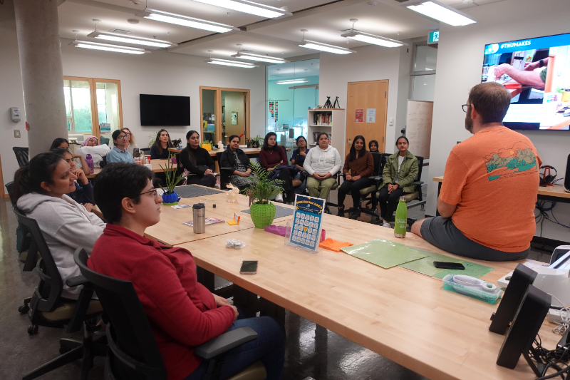

Helping Visual Arts students scan their 3D sculptures

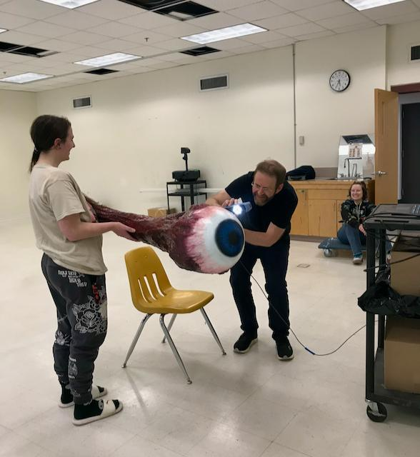

#### 3D Printing Workshops

Initially, I hesitated to offer workshops, believing they didn't align with our pedagogy and might detract from other initiatives. However, after running a few I found they often quickly filled up with participants, especially from equity-seeking groups who often don't utilize Makerspaces. This suggests that registering for a workshop gave these students the permission they needed to enter the space. I now run these semi-regularily and I'm developing other events that align with our pedagogies while supporting equity and community values.

- 2024-03-15: Workshop: Make Your First 3D Print: A Hands-On Beginner's Workshop 
- 2024-03-08: Workshop: Make Your First 3D Print: A Hands-On Beginner's Workshop 
- 2024-03-01: Workshop: Make Your First 3D Print: A Hands-On Beginner's Workshop 
- 2024-01-25: Workshop: Make Your First 3D Print: A Hands-On Beginner's Workshop 
- 2023-11-23: Workshop: Make Your First 3D Print: A Hands-On Beginner's Workshop 
- 2023-10-25: Workshop: Make Your First 3D Print: A Hands-On Beginner's Workshop
- 2023-10-12: Workshop: Make Your First 3D Print: A Hands-On Beginner's Workshop 
- 2023-09-26: Workshop: Make Your First 3D Print: A Hands-On Beginner's Workshop 

#### Other Teaching and Learning Contributions

- I regularly meet with faculty to discuss integrating making and active learning projects into their classes.
- I helped supervise a student's directed study project with faculty member Naowarat Cheeptham, which involved using 3D printers to create models of historical chemistry labs, now displayed in the Kamloops Art Gallery's "Gear Up" exhibition.

See Attachment: 

- 2023 gear up poster by Cheeptham for geordie directed study project.pdf

### Indigenization

Since I began planning the Makerspace in 2021, I've focused on building relationships with Indigenous students and faculty to ensure we fulfill our responsibilities around Indigenization and reconciliation. Since July 2022, I believe we have made significant progress towards integrating Indigenous content into the Makerspace through program changes and specific initiatives. 

#### Integration into Our Values and Program

Our Program Description states: "Makerspace supports Indigenization by facilitating and where possible resourcing Indigenous-led workshops and activities. Indigenous instructors maintain control over their knowledge, practices, and tools and determine the participants of their workshops and events." This statement emerged from conversations with Indigenous faculty, the Secwepemc cultural advisor, and Indigenous students. It guides how we operate, ensuring that Indigenous instructors always have control over their cultural practices and teaching.

In practice this has meant:

- Making the space welcoming to Indigenous students by hiring Indigenous student staff, incorporating Indigenous content, and going to events like Cplul'kw'ten's soup circle
- Give land acknowledgments whenever I give talk or welcome any group to the space
- Whenever possible provide space and resources for Indigenous faculty and students to run programming
- Ensuring Indigenous people have control over their culture. 
- Being flexible with our space and schedules, including staying late to host evening workshops
- Limiting social media promotion of these events to respect privacy and avoid preformative allyship
- Working with Indigenous Education and Cplul'kw'ten to make sure we are working with partners. 

Since July, 2022 I have: 

- Incorporated Indigenization as a core value in our Program Description (2023).
- Secured a Coyote Grant in 2023, funding outreach and programming. This included two welcome events for Indigenous students, organized with my Makerspace Sustainability Ambassadors, and workshops on moccasin and medicine bag making with Indigenous Education Cultural Coordinator Wynona Edwards. Additionally, we hosted two Feather Work workshops with CELT faculty member Laura Grizzlypaws and two beading workshops taught by Secwépemc Visual Arts student Charlayna Napoleon. (2023)
- Collaborated with Interim Associate University Librarian Julia Wells to develop HL161 into a permanent on-demand smudging room. (2022)
- Established a process for sharing HL161 with Indigenous Education and faculty from the Faculty of Student Development.
- Obtained a Sustainability Grant to fund a lunch for Indigenous faculty, where we discussed the current state of the Makerspace and explored further Indigenization opportunities. (2023)
- Hosted half-day visits for grades 5/6 and 7/8 students and teachers from the Chief Atahm School, allowing them to explore the Makerspace and engage in activities like 3D printing, sticker making, Virtual Reality, and media recording. (2024)
- Recruited 5 Indigenous students into paid roles as Makerspace Ambassadors or Research Assistants during the period covered by this APAR. (Ongoing)

#### Coyote Grant (2023-2024)

In fall 2023, I received a $6,000 Coyote Grant to fund Indigenous programming and students. I used the grant to support Indigenous-led initiatives:

- Two welcome events featuring VR games and sewing activities (about 20 participants) organized in partnership with my 2 Indigenous Student Sustainability Ambassadors. 
- Two moccasin making workshops with Indigenous Education's Cultural Coordinator Wynona Edwards.
- Two feather-work workshops with CELT faculty member Laura Grizzlypaws
- Two Beading workshops with Secwépemc Visual Arts student Charlayna Napoleon, that were open to the whole TRU Community and had seats specifically reserved for Library Staff. 

#### List of Indigenous Events (2022 - 2024)

- 2024-05-08: Visit from Chief Atahm School (10 attendees)
- 2024-05-22: Visit from Chief Atahm School grade (10 attendees)
- 2024-03-26: Event: Beaded Circle Workshop (7 attendees)
- 2024-03-25: Open event: Medicine Bags with Indigenous Education (6 attendees)
- 2024-03-20: Event: Beaded Circle Workshop (5 attendees)
- 2024-03-18: OPEN EVENT: Information Session for MMIWG Quilt Project (4 attendees)
- 2024-03-08: Welcome event for Cplul'kw'ten 
- 2024-03-04: Feather Work With Everette White (15 attendees)
- 2024-02-26: Feather Work With Everette White (12 attendees)
- 2023-11-06: Closed event: Moccasin Making (15 attendees)
- 2023-11-20: Closed event: Moccasin making 
- 2023-10-19: Indigenous Education and Indigenous Student Development and TRU Library Makerspace (14 attendees)
- 2023-10-03: CLOSED EVENT: Bannock and Beat Sabor (12 attendees)

### Sustainability

Over the past two years, I've led several initiatives focused on making sustainability - both environmental and social - central to how we operate.

#### Makerspace Sustainability Incubator Grant (Spring 2023-Spring 2024)

In spring 2023, I was awarded a $23,695 TRU Sustainability Grant to help transform the Makerspace into a hub for environmental and social sustainability. The idea was to leverage our strengths in equitable access, experimentation, and collaboration to enhance TRU's sustainability efforts.

This grant was a collaborative process and Makerspace staff and the 2 student Ambassadors Sustainability Champions participated in all parts. 

Hiring and supervising students: 

- Led recruitment and hiring of two Makerspace Sustainability Champions to work on the grant
- Assigned and oversaw the work of the Champions, including developing relationships with student clubs, running events, and creating promotional and educational materials.

Tool Library:

- Established a Tool Library, providing access to household, bicycle, and gardening tools to encourage repair and reuse.
- Conducted a user survey via social media, a whiteboard in the Makerspace, in addition to gathering ideas from students and faculty to guide tool selection.
- Researched and oversaw the purchasing of tools
- Worked with Technical staff to arrange for the tools to be cataloged, making them available for borrowing
- Developed lending processes and promotional materials, including a dedicated webpage.

Community Fabric Stash:

- Created a Community Fabric Stash to collect and redistribute fabric and textile donations.
- Developed usage and donation guidelines and secured shelving from the Trades program.
- Developed promotional materials and reached out to local businesses for donations.
- Worked with local Fabricland Manager to arrange large fabric donation.

Sustainability Incubator:

- Supervised two Student Sustainability Champions to build relationships and develop and run programming.
- Set up a booking system and guidelines for student clubs to use Makerspace resources.
- Hosted the MKSP Open House for TRUSU Clubs on November 16, 2023, to learn about their needs. 
	- Provided a platform for clubs to explore the Makerspace and share feedback.
	- Facilitated brainstorming with 3 facilitators to discuss issues and needs for groups seeking to run programming related to environmental sustainability, equity, and diversity.
	- Identified challenges such as raising awareness, securing meeting spaces, and accessing resources.

The Tool Library and Fabric Stash give us new ways to talk about repair and reuse, but I want to go further in encouraging users to think critically about the environmental and social impacts of what they make.

Attachments: 

- Grant Proposal: Makerspace Sustainability Grant 2023 Proposal FINAL.pdf
- Makerspace Sustainability Grant Final Report – TRU Library Makerspace (C7elelkstén’).pdf
- 2024 poster community fabric stash.jpg

Links:

- [[Makerspace Sustainability Grant Final Report – TRU Library Makerspace (C7elelkstén’)]] April 2024
- [[Sustainability Grant Update Tool Library Launches! Community Fabric Stash Coming Soon! – TRU Library Makerspace (C7elelkstén’)]] February, 2024
- [[Makerspace Sustainability Incubator Funded! – TRU Library Makerspace (C7elelkstén’)]] by Franklin Sayre, March 2023
- [Makerspace is Hiring TWO Makerspace Student Sustainability Champions! (UPDATE: HIRING CLOSED) – TRU Library Makerspace (C7elelkstén’)](https://makerspace.trubox.ca/2023/04/11/the-makerspace-is-hiring-two-makerspace-student-sustainability-champions/) (April 2023)

Whiteboard survey:

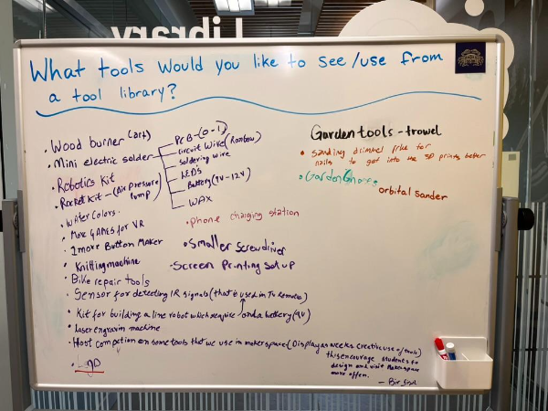

A very small selection of the tools we have available: 

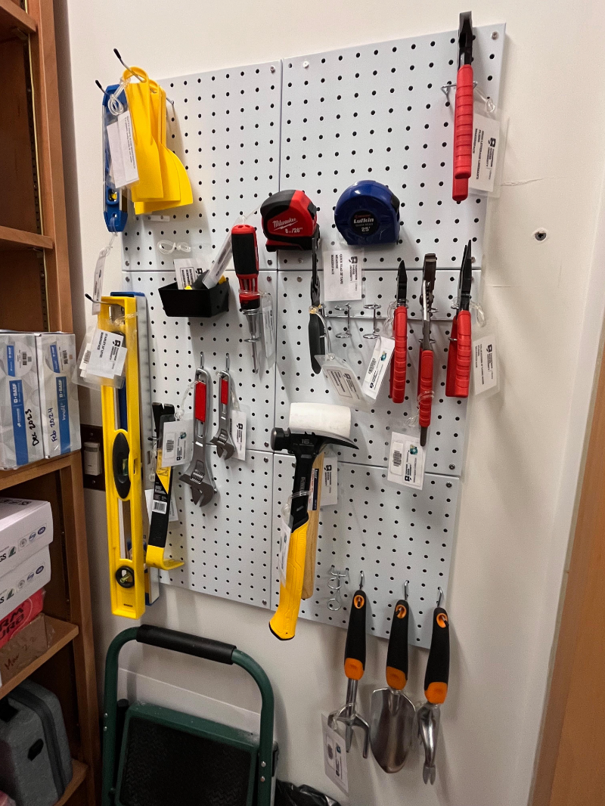

Facilitator faculty member Cheryl Gladu leading a session at the TRUSU Open House for Clubs event

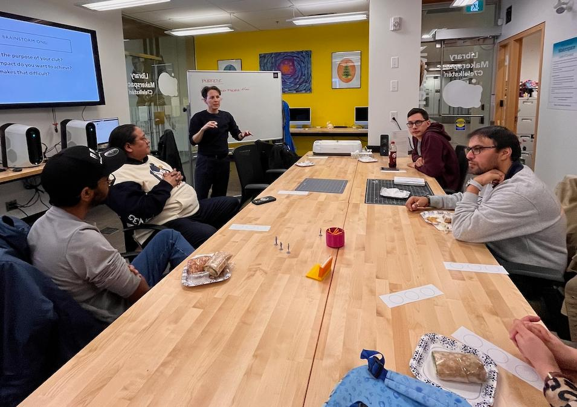

#### Repair Cafe Events (2023 - 2024)

Over the past two years, I collaborated with the Kamloops Repair Café and TRU Sustainability to host Repair Café events at the TRU Library Makerspace, promoting sustainability and community engagement. These events attracted over 300 participants and offered repair services for bicycles, electronics, and textiles, successfully reducing waste and empowering individuals with practical skills.

- Clothing Swap and Repair event with the TRUSU Eco Club in January 2023
- Repair Cafe open to Kamloops Community in November 2023
- Repair Café during SDG Week in March 2024. 

Repair Event in March 2023

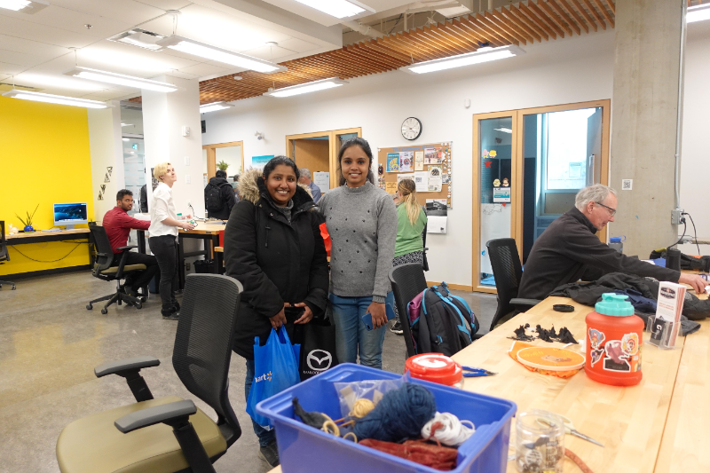

Repair Event in November, 2023

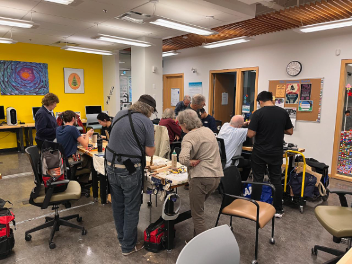

Repair event and clothing exchange in January, 2023

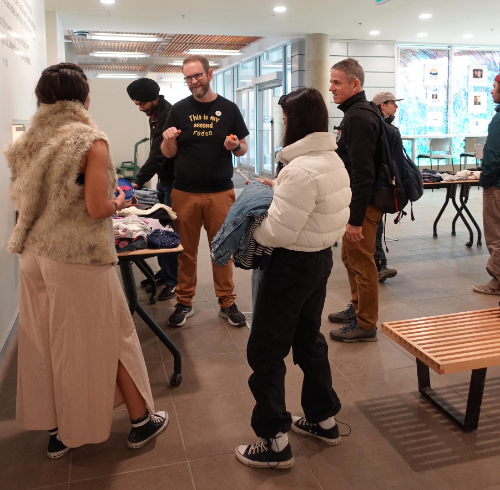

#### Plant Day for Earth Day (2024)

To celebrate Earth Day on April 22, 2024, I collaborated with the TRU Sustainability Office and Groundskeeping to organize "Plants for Earth Day," a community event that offered free resources for vegetable planting, including soil, seeds, planter pots, and expert advice. Sponsored by Stantec, the event also included a skill-testing contest with prizes to increase participation and environmental awareness. I coordinated logistics, recruited a student volunteer, and volunteered myself at the event. 

Plant Day 2023

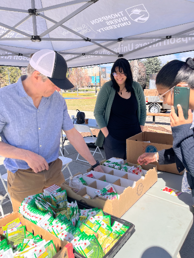

#### Filament Recycling (2023)

- Collaborated with the Sustainability Office to introduce a filament recycling program as part of our 3D printing services.

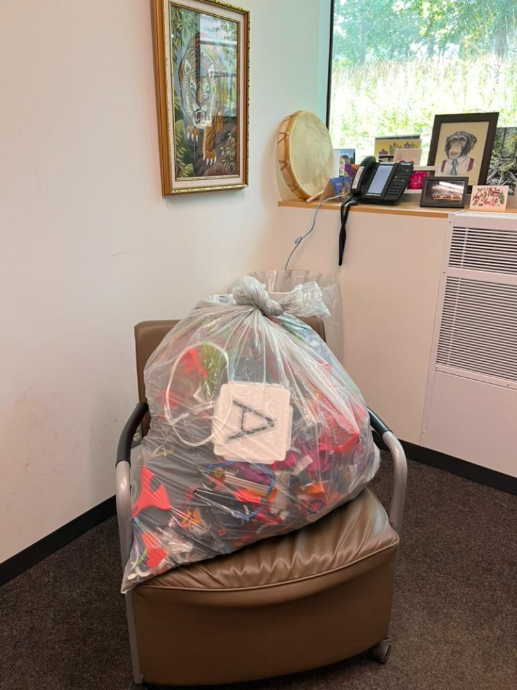

#### Sustainability Community of Practice Talk (2024)

In April 2024, I gave a talk for the TRU Sustainability Community of Practice titled "Making Sustainability: Repair, Maintenance, and Rehabilitation," in which I explored the integration of sustainability into the TRU Library Makerspace. The presentation was structured around three key areas: the Makerspace as an operations space, as a shared resource, and as a learning environment. I highlighted our efforts to incorporate sustainable practices, such as recycling materials, promoting repair and maintenance, and fostering a culture of stewardship. 

#### All Sustainability Related Events

- 2024-04-22 Earth Day Plant Exchange Event
- 2024-04-10: Sustainability Community of Practice (8 attendees):
- 2024-03-05: Repair Cafe for SDG Week Canada (120 attendees)
- 2024-02-22: Reception: Liveable Cities, Collaborative Communities (15 attendees)
- 2023-03-10: TRU Clothing Swap and Repair Event (100 attendees)
- 2023-11-16: Makerspace Open House for Clubs 
- 2023-11-18 Repair Cafe Event

Reception and workshop during the Liveable Cities, Collaborative Communities Conference: 

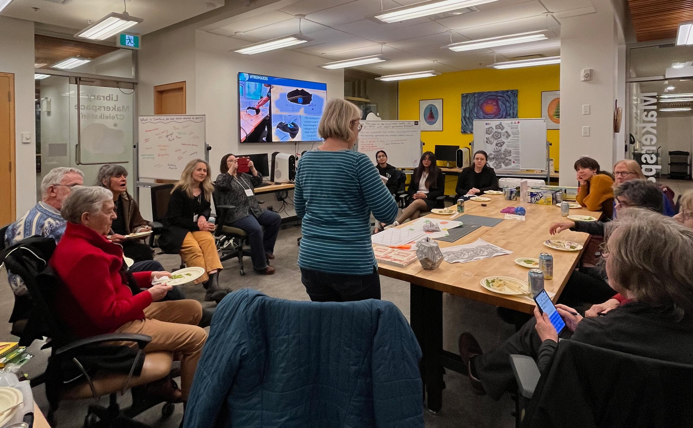

### Communication

Communication and outreach are an extension of our academic programming. Everything we post or publish tries to reinforce our values around belonging, community, and experiential learning.

The Makerspace Website had dozens of pages and over 60 blog posts. Our Instagram has had hundreds of posts over the last two years. These are a mix of things created by myself and staff/students. I am not going to try to include everything. Here I am including things not listed elsewhere. 

#### Website Updates

- Supervised a Student Research Assistant from Communications in 2022-2023 to build the TRU Library Makerspace Website.
- Worked with Makerspace staff from 2022 to 2024 to update and modify the website based on user needs.
- Oversaw a mini-redesign of the website with Technicians Sarah Porter and Olivia Strodl in 2023-2024. The goal was to guide visitors towards new pages on how they can use the Makerspace and to increase sharing of user stories. We rewrote about half of the website pages over a term and redesigned the website's menu system.
- Assigned page edits and approve the final versions of the updated pages and blog posts

Photo of card sorting activity I did with Makerspace Staff as part of a mini-redesign in 2023 

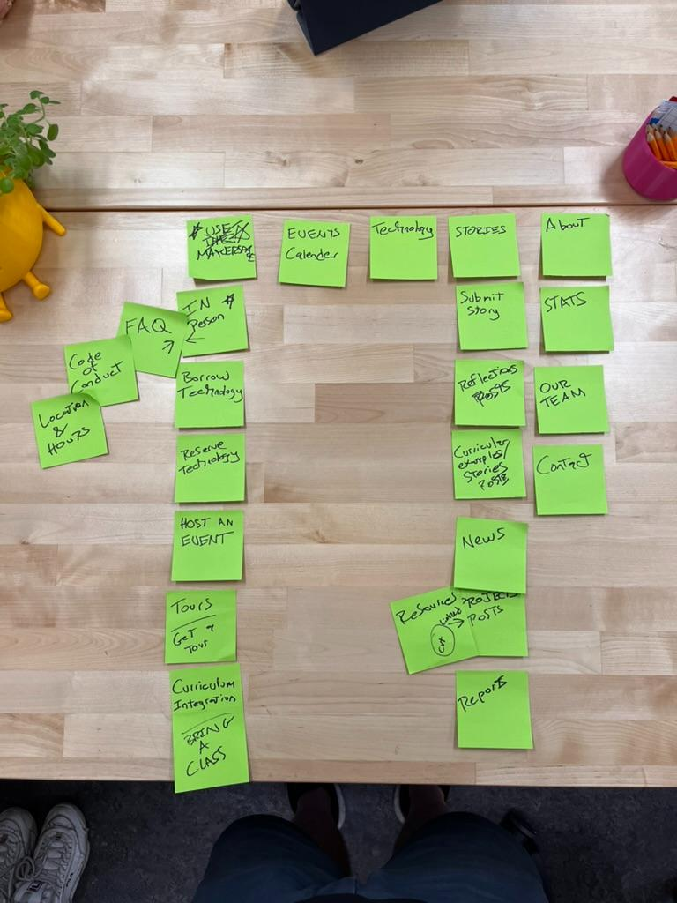

#### Makerspace Librarian Reports

Each term, I write a report capturing what's happening in the space. These reports have become an important way to document our growth and share our learning with other makerspaces. They're also helping us build an archive of stories about how the space has evolved.

Attachments:

- Winter 2024 Makerspace Librarian’s Report – TRU Library Makerspace (C7elelkstén’).pdf
- Winter 2023 TRU Library Makerspace Librarian’s Report – TRU Library Makerspace (C7elelkstén’).pdf
- Summer and Fall 2023 Makerspace Librarian’s Report – TRU Library Makerspace (C7elelkstén’).pdf
- Fall 2022 TRU Library Makerspace Report – TRU Library Makerspace (C7elelkstén’).pdf

#### Social Media

- Collaborated with student research assistants in 2021-2022 and staff in 2022-2024 to develop and implement a social media strategy aligned with our values.
- Aimed to create a presence that drives engagement by reinforcing our values and demonstrating our impact.
- Worked with Library Technician Sarah Porter in early 2023 to develop templates and posting schedules.
- Held regular meetings with Sarah to discuss post ideas and responses to events and activities.
- Experimented with sharing user-generated content, student and ambassador takeovers, and posting instructional material.
- Currently, two staff members handle most posting, which I approve or edit. 
- Actively post on our blog and Instagram myself

Links:

- [TRU Library Makerspace (@trumakerspace) • Instagram photos and videos](https://www.instagram.com/trumakerspace/)

Post Developed by Makerspace Technician Sarah Porter to celebrate The Makerspace's first birthday

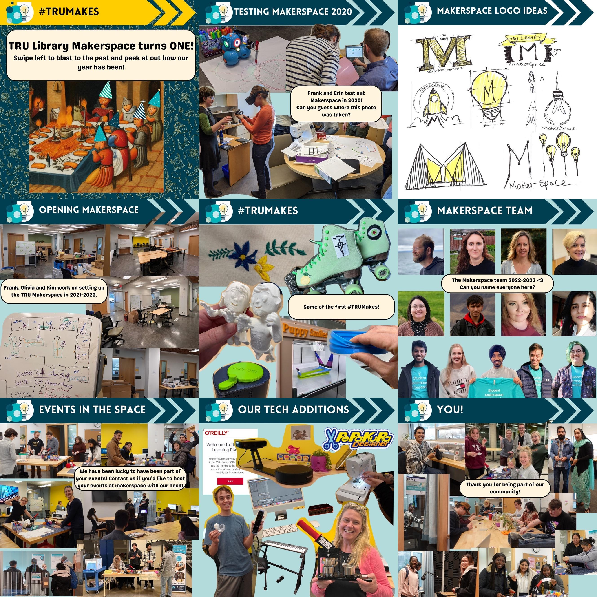

Links:

- [TRU Library Makerspace | Third year biology student Manuel Duque explaining the NSERC-funded research supervised by Dr. Eric Bottos. Hear about the implications of... | Instagram](https://www.instagram.com/reel/C5EDo0PLv1T/?utm_source=ig_web_copy_link&igsh=MzRlODBiNWFlZA==) Interview and Video by Franklin Sayre (2024)

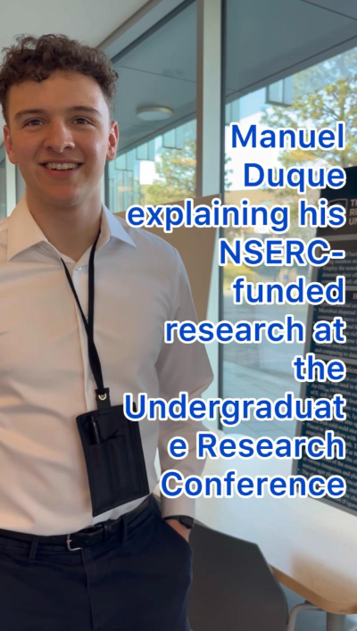

#### Blog Posts by Me Not Included Elsewhere

Links: 

- [[Developing and Assessing a Culture of Change at the TRU Library Makerspace – TRU Library Makerspace (C7elelkstén’)]] (May 2024)
- [[New 3D Printing Rules and Guidelines – TRU Library Makerspace (C7elelkstén’)]] (November 2023)

Attachments:

- Minimalist Making – TRU Library Makerspace (C7elelkstén’).pdf (February 2023)
- A Tail of 2 Failed 3D Prints/ Printing Complex Objects – TRU Library Makerspace (C7elelkstén’).pdf (October 2023)

#### Blog Posts by Students and Staff Overseen by Me Not Included Elsewhere

- [[Artwork added to Makerspace! – TRU Library Makerspace (C7elelkstén’)]] by Makerspace Library Technician Sarah Porter 
- [Exploring Educational Learning Outcomes in a Makerspace – TRU Library Makerspace (C7elelkstén’)](https://makerspace.trubox.ca/2022/07/28/exploring-educational-learning-outcomes-in-a-makerspace/) (July 2023) by Makerspace Research Assistant and Bachlor of Education student Dalton Hargreaves
- [Makerspace Team Grows! – TRU Library Makerspace (C7elelkstén’)](https://makerspace.trubox.ca/2023/10/25/makerspace-team-grows/) by Sarah Porter

#### Statistics

Numbers can only tell part of our story, but they help show how the Makerspace has grown from an experiment into a key resource for TRU students, faculty, and staff. Reference questions, gate counts, 3D printing usage, circulation, room reservations, and digital engagement have all increased, especially during academic peak periods (September, October, and March). 

All our statistics are publicly available on our website's About page because transparency is important to us: [About – TRU Library Makerspace (C7elelkstén’)](https://makerspace.trubox.ca/about/#stats). 

I also provide an overview of our statistics at the end of every term in my Librarian's Report Reports.  

Combined Stats: Trends from 2021-2024 

Reference Questions

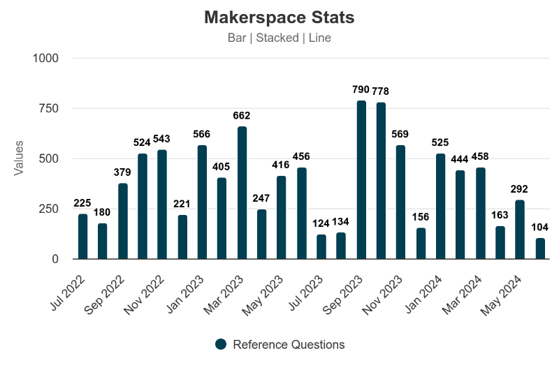

#### Makerspace Assessment Project and WILU 2024 Presentation

Working with our Assessment Librarian and Makerspace staff, I initiated a research project to better understand how people use our space and what impact we're having. While I'll be honest and admit the publication is currently stalled (things are busy!), we did present initial findings at the 2024 WILU Conference and I am hopeful to have a draft of my sections for my colleagues to review soon. 

- Prepared a project involving a survey, ethnographic observations, and interviews.
- Completed the ethics review process.
- Successfully collected and analyzed all data.

One thing that made this research and presentation special was including all our Library Technicians as co-authors and having one join us as a co-presenter at the conference. Their direct experience with users brought invaluable perspective to our research, and presenting together reflected our collaborative approach to running the space.

Attachments:

- SayreFranklin_DevelopingandAssessingaCultureofChangeattheTRULibraryMakerspace_WILU2014_NOTES.pdf

Links:

- [Research Project Starting Next Week in the Makerspace – TRU Library Makerspace (C7elelkstén’)](https://makerspace.trubox.ca/2023/01/13/research-project-starting-next-week-in-the-makerspace/) By Franklin Sayre (January 2023)

### Outreach

#### Outreach to Individuals and Groups

While I don't meticulously track my outreach activity, here are some examples that illustrate the range and scope of my efforts. 

Meetings with Departments and Individuals:

- Sukh Matonovich, Lincoln Smith, and Kate Fagervik from the research office to discuss potential collaborations.
- Hosted Kate Fagervik in the makerspace to talk with our staff about operational insights for the research hub.
- Hosting departments or programs in the makerspace to talk to them about the makerspace and how we might work together, e.g. Future Students, TRU Generator, Open Learning Media Services, the Sexualized Violence Prevention and Response office, Trades faculty, Nursing Simulation Lab
- Toured Valleyview High School's makerspace in School District 73.
- Collaborated with the SD74 technology coordinator to organize networking events for TRU faculty and school district teachers.
- Hosted teachers and coordinators from School District 74 to discuss tech instruction.
- Partnered with Horticulture for a 3D printed plant pot project.
- Explored collaboration opportunities with the TRU Generator.

Outreach Events:

- Participated in events like the Long Night Against Procrastination.
- Facilitated staff development and team-building events for departments, like the Law Department's Christmas ornament-making event and staff PD Events
- Hosted student groups and tours for potential future students, with a focus on equity, diversity, and inclusion, such as Women in Engineering High School Girls Robotics Events.

#### Women in Engineering Highschool Girls Robotics Workshop (2022 - 2024)

I co-host 2 Women in Engineering Robotics Event for high school girls each year in collaboration with Engineering Faculty. These events bring high school girls to TRU to spend a half day in the Makerspace and a half day learning about robotics and opportunities for women in engineering. 

#### Makerspace Family Day (2023)

I organized a Family Day event for TRU parents to bring their kids into the Makerspace for fun activities. This event was in response to frequent requests from parents who wanted to bring their children into the space, which isn't designed for that purpose. I created a structured environment by closing the space to other users for a day and getting parents to register and agree that they would come with their kids and spend the time making things together. The event was enjoyable and served as good outreach to the TRU community, though I am not sure its feasible to do again with current staffing. 

#### PD Week Workshops for CUPE Staff (2023)

During PD Week in February 2023, I developed and facilitated two 2-hour workshops for TRU CUPE staff. These workshops introduced participants to the TRU Library Makerspace, offering hands-on experience with technologies like 3D printing, virtual reality, vinyl cutting, and button making. Participants engaged in active, hands-on learning, exploring tools independently and in groups. 

PD Week 2023: Having each person teach the next how to use the button maker 

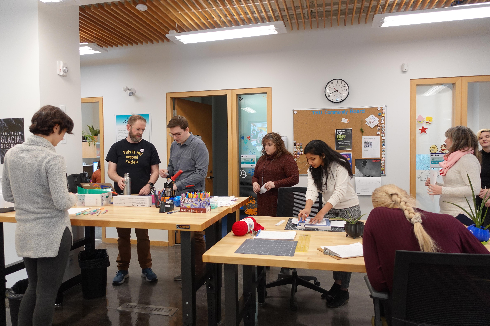

#### Events and PD for Internal Library Staff:

These are events for Library Staff. These have mostly been overseen by Makerspace staff, with me helping determine scope and mentor staff on organizing events. 

- 2023-05-30: LCSA Book Binding (7 attendees)
- 2023-06-06 Presentation about Makerspace to Library Staff 
- 2023-06-06: LCSA book binding workshop 2 (7 attendees)
- 2023-08-23: Library staff making event: Zine workshop
- 2023-10-13: OPEN EVENT: Library Staff Costume Making Event (0 attendees)

#### List of All Outreach Events (not including Indigenous or Sustainability Related events)

- 2024-05-03: TRU World Orientation (21 attendees)
- 2024-04-20: Women in Engineering Robotics Workshop (12 attendees)
- 2024-04-09: School of Nursing Simulation Team (4 attendees)
- 2024-02-08: Research Rookies from Office of Undergraduate Research
- 2024-01-10: Integrated Planning and Effectiveness 
- 2023-12-14: Law department Christmas ornament making event (13 attendees)
- 2023-10-11: TRU Future Student Ambassadors
- 2023-08-09: Admissions department event (12 attendees)
- 2023-07-19: Makerspace Family Day (13 attendees)
- 2023-07-18: Staff Meeting for Office of the Vice President Research (10 attendees)
- 2023-05-05: Future students Ambassadors tours 
- 2023-03-08: International women's day panel discussion (12 attendees)
- 2023-03-08: International women's day zine making workshop 
- 2023-03-04: Women in Engineering Workshop (12 attendees)
- 2023-02-23: NorKam tour 1 (25 attendees)
- 2023-02-23: PD week makerspace workshop (7 attendees)
- 2023-02-24: NorKam tour 2 (19 attendees)
- 2023-02-24: PD week makerspace workshop (6 attendees)
- 2023-02-01: International women's day event
- 2022-12-15: Faculty and Staff of LAW Christmas decorating event (9 attendees)
- 2022-11-19: Women in Engineering Event (6 attendees)
- 2022-11-19: Women in Engineering (6 attendees)
- 2022-11-17: OPEN EVENT: LNAP Makerspace Event (60 attendees)
- 2022-11-08: Faculty of Education and Social Work staff and faculty (10 attendees)
- 2022-11-04: Makerspace Ambassador Outreach Event 
- 2022-08-23: Makerspace tour for Finance/Procurement/Warehouse (3 attendees)
- 2022-08-18: Makerspace tour for Finance/Procurement/Warehouse (3 attendees)
- 2022-08-18: Makerspace tour for Finance/Procurement/Warehouse (4 attendees)
- 2022-07-15: Staff visit from Future Students 

#### Creating a Booking Process to Facilitate Community Programming in the Makerspace

In an effort to enhance the utilization of the TRU Makerspace by campus groups, I implemented a streamlined system to facilitate event and group bookings. 

- Created a user-friendly online form and comprehensive guidelines for events.
- Worked with staff to developed internal processes for organizing events within the Makerspace.
- Utilized these processes for events organized by myself, staff, and other campus groups.
- Achieved a significant increase in event bookings since implementation.
- Hosted a diverse array of workshops, classes, and community events.

#### Events Run by Student Groups or other Faculty in the Makerspace

- 2024-03-12: TRUSU Blood Club (8 attendees)
- 2023-05-31: LTI Memes and GIFs workshop 
- 2023-03-22: GEOG 4990 Rock painting activity (12 attendees)
- 2023-03-23: GEOG 4990 Stained glass making (15 attendees)
- 2023-03-29: GEOG 4990 Mason Bee House workshop (12 attendees)
- 2023-03-29: GEOG 4990 Mason Bee House workshop (9 attendees)
- 2022-10-14: Makerspace Tour for Physics Club (5 attendees)
- 2022-10-20: Anime Club Event (4 attendees)
- 2022-10-21: Anime Club Event (4 attendees)
- 2022-07-06: Physics club tour (6 attendees)

### Overseeing Staff and the Operations Team

I lead the Makerspace Operations Team, which includes four library technicians and a faculty librarian who provides backup support for me at 5% of their assigned workload. We work as a collegial team, meeting weekly to discuss common issues as a group and using consensus to make decisions whenever possible. My leadership approach mirrors the Makerspace's pedagogical philosophy of self-directed, experiential learning.

This means:

- I establish core values and objectives while giving staff significant autonomy in their areas of responsibility  
- Staff apply their direct experience to improve operations and processes
- We make most decisions collaboratively through regular team meetings
- Staff are encouraged to experiment and pursue projects aligned with their interests
- While staff have considerable independence, I maintain ultimate responsibility for the Makerspace

This model has proven effective through multiple staffing changes and has enabled greater innovation than would have been possible with a more traditional approach. It has also been a lot more fun. 

- Worked with Library Administration to ensure adequate staffing throughout the year 
- Managed staffing changes, including having 3 staff members move onto better positions or post-secondary institutions
- Trained new staff as needed, including 5 during the period covered by this APAR
- Developed and oversee team infrastructure, including the use of Teams for communication, a shared email address, calendars, etc.
- Developed a shared chairing model for our operations team, where we all share chairing meetings.
- Mentored staff on chairing meetings and taking more of a leadership role
- Assign and oversee functional work areas to staff, for example:
	- Maintaining statistics and our statistics dashboard
	- Coordinating events with external group
	- Social media and blog posts
	- Purchasing of technologies and supplies
	- Working with the technicians responsible for Cataloguing 
- Meet regularly one-on-one with technicians to discuss assigned functional roles, problem solve, and plan
- Oversee work shared by all assigned staff, e.g.
	- Customer service
	- Equipment maintenance
	- Facilities maintenance
- Assign special functional area projects to staff, for example:
	- Developing training material for the tool library
	- Redesigning our website
	- Creating posters and other materials
- Participate and/or plan in team building 
	- Invited by staff to attend 2 escape room events after work and 3 dinners
	- Plan birthday and holiday parties and events

#### Operations Team Charter

In spring/summer 2023, I led the development of our Makerspace team charter. The charter defines our five core values: kindness, growth, community, autonomy, and fun. For each value, we established specific team norms that foster welcoming and inclusive interactions, support creativity and innovation, enable effective communication and conflict resolution, define decision-making processes, clarify roles and responsibilities, prioritize on-duty staff needs, guide support for student workers, and set expectations for team development and celebration. This charter helps ensure our operations consistently reflect our values while providing clear guidance for the team's work together.

Attachment: 

- TRU Library Makerspace Team Charter Final.pdf

Silly posters I made for each of our values. These posters now hang in the Makerspace Staff office, as well as in my office

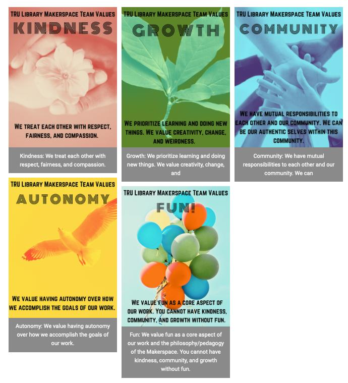

#### Makerspace Team Development Days

I organize regular team days that combine program development, collective learning, and team building. These sessions help us reflect on our experiences, improve our services, and strengthen our ability to work together effectively. Between 2022-2024, I held 1-3 team development days each summer, plus additional sessions throughout the year.

##### Summer 2022: Building Our Foundation

In our first summer after opening, I focused on establishing core operations and shared understanding:

- Led collaborative planning sessions to address operational challenges and prioritize tasks such as reducing the impact of boundary issues on staff, simplifying 3D printing processes, and creating help sheets for various tools like Cricut, embroidery, Raspberry Pi, and sewing machines.
- Guided development of user support materials and learning resources
- Facilitated events and other efforts to bring other Library staff into the space more frequently, helping them understand the operations and activities of the Makerspace.

##### Summer 2023: Developing Our Narrative

In the summer of 2023, with a better understanding of the space and a solid foundation as a team, I led multiple program development and team-building exercises focused on the theme of "Stories." This theme emerged from the realization that the true value of our Makerspace lies not in the objects created but in the personal growth and sense of belonging it fosters among users. My primary goal was to capture and learn from these user stories to enhance the Makerspace's inclusivity and educational impact:

- I organized a series of development days that included activities such as podcasting, game design, and collaborative storytelling through mini-D&D games.
- Led reflection exercises to identify user stories and look for patterns in user experiences
- Facilitated discussions about making our space more welcoming and inclusive
- Helped staff develop skills for capturing and sharing user success stories

Attachments: 

- Summer 2023 PD Planning.pdf

##### List of All Staff Team Development Events

- 2022-12-09: Makerspace Staff Professional Development Day
- 2023-06-16: Makerspace Staff Professional Development Day
- 2023-07-11: Makerspace Staff Professional Development Day: MIRA conference
- 2023-07-12 Reviewing other Makerspace websites and services
- 2023-07-21: Makerspace Staff Professional Development Day
- 2023-12-20: Makerspace Staff Professional Development Day
- 2024-01-17: Birthday Extravaganza
- 2024-02-21: Makerspace Staff Professional Development Partial Day 
- 2024-02-27: Makerspace Staff Professional Development Partial Day (audio workshop)

#### Development of Staffing Plan (2022-2023)

In March 2022, I developed a staffing plan for our first full term, addressing significant staffing changes, including the departure of an original staff member and the addition of two new team members. This staffing plan emphasized the need for dedicated LCSAs due to high usage and hands-on work and highlighted the importance of training staff and students to understand our pedagogical model.

- Established operating hours: Monday to Friday, 10 AM to 4 PM.
- Proposed staffing structure: 1.5 LCSAs, four Work Study Students, and 2-3 Research Assistants.
- LCSAs managed the space, provided public service, and maintained equipment.
- Student Ambassadors handled tours, orientations, and user support.
- Research Assistants focused on research and curricular activities.

#### Student Research Assistant Supervision (2021-2023)

From the fall of 2021 until the spring of 2023 I supervised 3-4 Student Research Assistants who helped me develop the Makerspace. 

While supervising these students I: 

- Tried whenever possible to align their educational goals with Makerspace projects to give them applicable experience. 
- I focused on curricular development with my Bachelor of Education student, overseeing their creation of tutorials and other materials. They also had an interest in technology and statistics which we used to create 3D printer processes and determine a way of gathering statistics from our printers. 
- Directed a Communication student in creating our website and writing articles and blog posts, as well as supporting media strategy.

### Operations

I oversee all aspects of the Makerspace. Listed here are some of the operational projects or tasks I have led that aren't listed elsewhere:

#### Security

I worked with Administration and staff in response to security incidents in December 2022 and January 2024. 

- Collaborated with administration and staff to address security issues and enhance security while prioritizing our values of community, belonging, and equitable access. 
- Worked to Implemented non-intrusive security measures including:
	- Installing a security system
	- Adding protective film to windows
- Worked with staff to establish clear protocols for securing the space.

These measures have successfully prevented further incidents while maintaining the Makerspace's open and inclusive atmosphere.

The 3D print room following a break-in in December, 2022. 

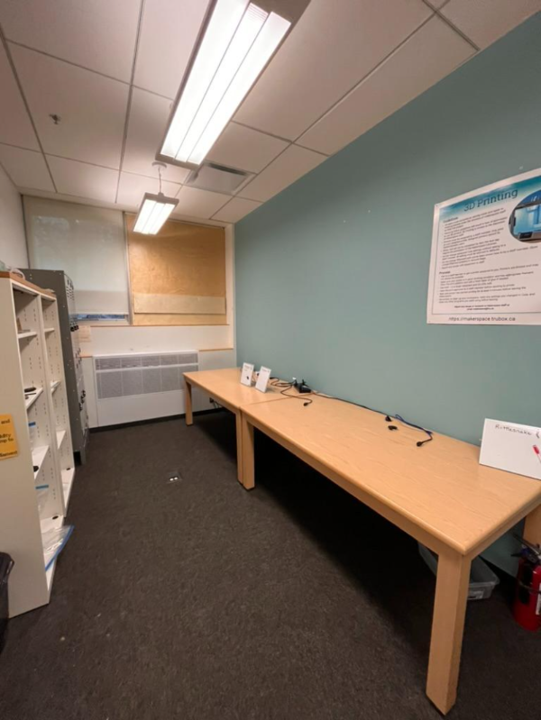

#### Managing the Makerspace Budget and Purchasing

I manage the Makerspace's annual operating budget of $11,000 and oversee additional grant funding. The annual budget is used for supplies, hardware and software replacements, collection development, and events. I use this budget to support and expand programming, and I make decisions based on cost, user needs, feedback, and cost-effectiveness.

- Prioritize essential equipment and supplies based on user feedback, for example, we expanded the podcasting studio into a general-purpose recording studio in fall 2022 by purchasing a keyboard and an interface based on numerous student requests. 
- Balance initial costs with long-term use and impact by purchasing durable items and making everything as available as possible by loaning things our for use when it makes sense. 
- Adjust usage guidelines in response to market changes, such as limiting the number of buttons people or groups can make when button template costs increased tenfold.
- I oversee purchasing, collaborating with a Makerspace Technician to find and review items before finalizing purchases, while trusting staff to decide on replacement parts and supplies we have experience purchasing.

I also successfully applied for grants which I oversee the budgets of, including a $23,695 Sustainability Grant and a $6,000 Coyote Grant. 

#### Collection Development

 I have developed a small library of physical books that supports our users with a focus is on technical manuals and books about the cultural and historical contexts of technology. I also try to collect books on things like interview skills and budgeting, that students might discover by chance and we know from experience they could use. 

Recently, I've focused on acquiring books about sustainability, nature, rewilding, and alternative technologies or critical making.

#### Cataloging

From 2022 to 2024, I led cataloging projects to make our tools and technologies lendable, enhancing their accessibility. 

- Collaborated with the four librarians variously assigned to oversee cataloguing during this timeframe to align timelines and expectations.
- Worked with a Makerspace Library Technician and cataloging Technicians to ensure accurate cataloging, descriptions, and labeling for lending.
- Worked with Operations Team and Technicians to figure out best ways to package materials, such as bags or backpacks, to make them easy for users to check out and use, while also protecting our materials for future users. 
- Catalogued all items we felt could be reasonable lent out, including things like cameras, microphones, sewing machines, and 3D scanners.
- Cataloged all tools within our Tool Library, supporting the Makerspace Sustainability Incubator Grant.

Lending stats for items

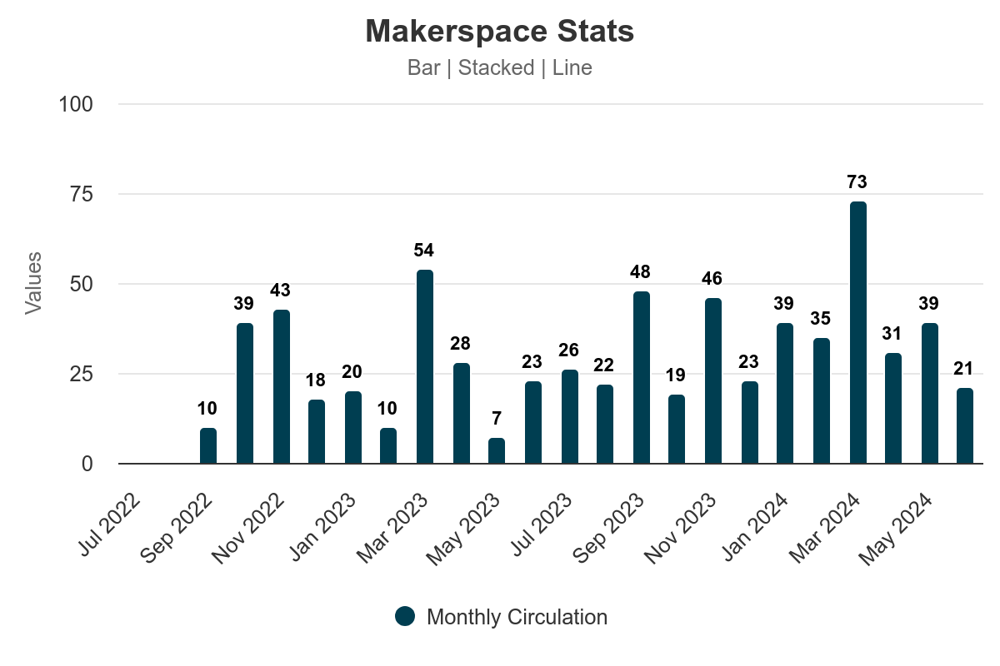

#### Developing Loan Policies

In 2023 and 2024, I led our team in creating our lending guidelines for equipment based on our experience and trying to balance providing equitable access with making sure lots of people have access to our high-demand tools. This was very much a collaborative effort, as staff know best what users are doing and asking for and what issues emerge. 

- Revised internal guidelines in 2023: 3-day default loan period, no renewals or holds, 3-day waiting period for re-checkouts.
- In 2024, the Systems Librarian led a comprehensive policy overhaul and we finalized official guidelines to be: 
	- 3-day default loan period, adjustable by staff for specific projects.
	- Borrowing limited to current students and staff; community members and alumni excluded.
	- $20 replacement fee for lost or damaged items.
	- No recalls on Makerspace items.
	- Account blocks for unreturned items at term's end, removed upon return with no penalties.
	- $2.00 per hour overdue fines, waived upon item return.
